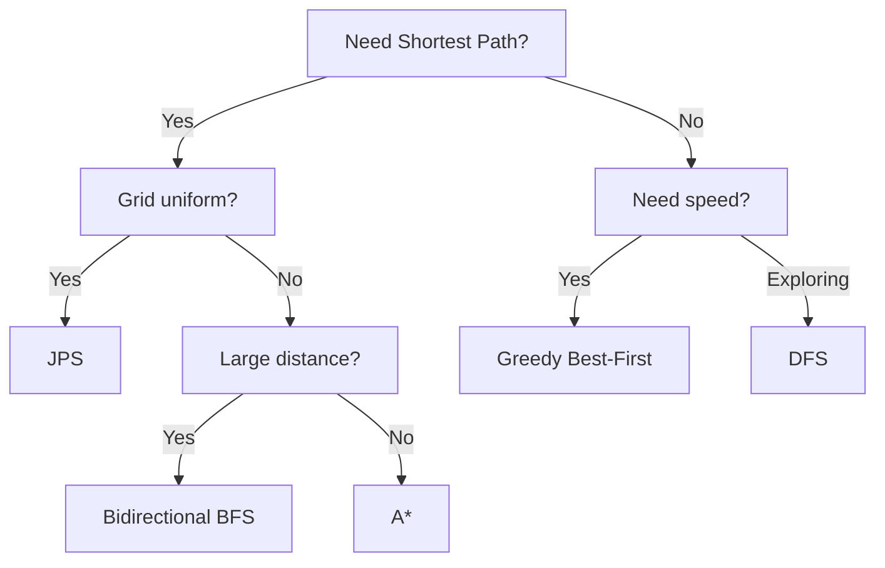

<p align="center">
  
</p>

<h1 align="center">PathViz</h1>

<p align="center">
  <strong>Interactive Pathfinding Algorithm Visualizer</strong>
</p>

<p align="center">
  
  
  
  
  
</p>

<p align="center">
  Watch pathfinding algorithms explore and find the shortest path in real-time with stunning animations.
</p>

---

## 📖 Table of Contents

- [Features](#-features)
- [Algorithms](#-algorithms)
  - [Dijkstra's Algorithm](#1-dijkstras-algorithm)
  - [A* Search](#2-a-search)
  - [Breadth-First Search](#3-breadth-first-search-bfs)
  - [Depth-First Search](#4-depth-first-search-dfs)
  - [Greedy Best-First Search](#5-greedy-best-first-search)
  - [Bidirectional BFS](#6-bidirectional-bfs)
  - [Jump Point Search](#7-jump-point-search-jps)
  - [Swarm Algorithm](#8-swarm-algorithm)
- [Algorithm Comparison](#-algorithm-comparison)
- [Getting Started](#-getting-started)
- [Usage Guide](#-usage-guide)
- [Project Structure](#-project-structure)
- [Tech Stack](#-tech-stack)
- [Contributing](#-contributing)
- [License](#-license)

---

## ✨ Features

### 🔍 **8 Pathfinding Algorithms**
Visualize and compare a diverse set of pathfinding algorithms, from classic approaches to advanced optimizations.

### 🎨 **Interactive Grid**
| Feature | Description |
|---------|-------------|
| **Dynamic Grid Size** | Adjustable from 10×10 to 50×50 cells |
| **Draw Walls** | Click and drag to create obstacles |
| **Set Points** | Place start (green) and end (red) points anywhere |
| **Real-time Updates** | See changes instantly as you interact |

### 🌀 **Maze Generation**
Generate random, solvable mazes using the **Recursive Backtracker Algorithm** with a single click.

### ⚡ **Animation Controls**
- **Speed Control**: Adjust animation speed (1ms - 100ms per step)
- **Visual Feedback**: Watch visited cells and final path animate
- **Path Statistics**: View path length after visualization

---

## 🧠 Algorithms

### 1. Dijkstra's Algorithm

> **The gold standard for shortest path finding**

Dijkstra's algorithm finds the shortest path by exploring nodes in order of their distance from the start. It guarantees the optimal solution for weighted graphs.

**How it works:**
```
1. Initialize distances: start = 0, all others = ∞
2. Add start to priority queue
3. While queue is not empty:
   a. Extract node with minimum distance
   b. For each unvisited neighbor:
      - Calculate new distance through current node
      - If shorter, update distance and add to queue
4. Reconstruct path from end to start
```

**Characteristics:**
| Property | Value |
|----------|-------|
| Time Complexity | O((V + E) log V) |
| Space Complexity | O(V) |
| Guarantees Shortest Path | ✅ Yes |
| Best For | Weighted graphs, guaranteed optimal path |

---

### 2. A* Search

> **The intelligent pathfinder**

A* combines Dijkstra's completeness with a heuristic to guide the search toward the goal. It uses **f(n) = g(n) + h(n)** where g(n) is the cost from start and h(n) is the estimated cost to goal.

**How it works:**
```
1. Initialize: g(start) = 0, f(start) = h(start)
2. Add start to open set (priority queue)
3. While open set is not empty:
   a. Get node with lowest f-score
   b. If goal reached, reconstruct path
   c. For each neighbor:
      - Calculate tentative g-score
      - If better path found, update scores
      - Add to open set with f-score priority
```

**Heuristic Used:** Manhattan Distance
```typescript
h(n) = |n.x - goal.x| + |n.y - goal.y|
```

**Characteristics:**
| Property | Value |
|----------|-------|
| Time Complexity | O((V + E) log V) |
| Space Complexity | O(V) |
| Guarantees Shortest Path | ✅ Yes (with admissible heuristic) |
| Best For | Large grids, when goal location is known |

---

### 3. Breadth-First Search (BFS)

> **Level by level exploration**

BFS explores all neighbors at the current depth before moving to the next level. It's the simplest algorithm that guarantees the shortest path in unweighted graphs.

**How it works:**
```
1. Add start to queue, mark as visited
2. While queue is not empty:
   a. Dequeue front node
   b. If goal, reconstruct path
   c. For each unvisited neighbor:
      - Mark as visited
      - Record parent
      - Add to queue
```

**Characteristics:**
| Property | Value |
|----------|-------|
| Time Complexity | O(V + E) |
| Space Complexity | O(V) |
| Guarantees Shortest Path | ✅ Yes |
| Best For | Unweighted graphs, finding shortest hop count |

**Visual Pattern:** Expands in circular waves from the start point.

---

### 4. Depth-First Search (DFS)

> **Explore as deep as possible first**

DFS explores as far as possible along each branch before backtracking. It's memory-efficient but does NOT guarantee the shortest path.

**How it works:**
```
1. Push start to stack
2. While stack is not empty:
   a. Pop top node
   b. If not visited:
      - Mark as visited
      - If goal, reconstruct path
      - Push unvisited neighbors to stack
```

**Characteristics:**
| Property | Value |
|----------|-------|
| Time Complexity | O(V + E) |
| Space Complexity | O(V) |
| Guarantees Shortest Path | ❌ No |
| Best For | Maze solving, exploring all possibilities |

**Visual Pattern:** Creates long, winding paths before backtracking.

---

### 5. Greedy Best-First Search

> **Fastest route to the goal (usually)**

Greedy Best-First uses ONLY the heuristic to decide which node to explore next. It always moves toward the goal but may not find the optimal path.

**How it works:**
```
1. Add start to priority queue with h(start)
2. While queue not empty:
   a. Get node with lowest heuristic
   b. If goal, return path
   c. For each neighbor:
      - Add to queue with priority = h(neighbor)
```

**Key Difference from A*:**
- A*: `priority = g(n) + h(n)` (actual + estimated)
- Greedy: `priority = h(n)` (estimated only)

**Characteristics:**
| Property | Value |
|----------|-------|
| Time Complexity | O((V + E) log V) |
| Space Complexity | O(V) |
| Guarantees Shortest Path | ❌ No |
| Best For | Speed over optimality, open areas |

**Visual Pattern:** Beelines toward the goal, may get stuck behind obstacles.

---

### 6. Bidirectional BFS

> **Search from both ends simultaneously**

Bidirectional BFS runs two simultaneous BFS searches—one from the start and one from the end. They meet in the middle, reducing search space significantly.

**How it works:**
```
1. Initialize two queues: queueStart and queueEnd
2. Initialize two visited sets
3. Alternate between:
   a. Expand one node from start frontier
   b. Check if visited by end search → path found!
   c. Expand one node from end frontier  
   d. Check if visited by start search → path found!
4. Merge paths at meeting point
```

**Why it's faster:**
```
Standard BFS: Explores circle of radius d
              Area = πd²

Bidirectional: Two circles of radius d/2
               Area = 2 × π(d/2)² = πd²/2 (half!)
```

**Characteristics:**
| Property | Value |
|----------|-------|
| Time Complexity | O(V + E) |
| Space Complexity | O(V) |
| Guarantees Shortest Path | ✅ Yes |
| Best For | Large open spaces, distant targets |

---

### 7. Jump Point Search (JPS)

> **A* on steroids for uniform grids**

JPS is an optimization of A* specifically designed for uniform-cost grids. It "jumps" over unnecessary nodes, exploring only "jump points" where direction changes are needed.

**How it works:**
```
1. From current node, identify jump points:
   - Jump in each direction until hitting:
     a. The goal
     b. A wall
     c. A "forced neighbor" (turn required)
2. Only add jump points to open set
3. Continue A* with jump points only
```

**What are Jump Points?**
Points where the path must change direction due to obstacles.

```
. . . . .     Legend:
. # # . .     S = Start, G = Goal
S → → J .     # = Wall, J = Jump Point
. . . ↓ .     → ↓ = Jump direction
. . . G .
```

**Characteristics:**
| Property | Value |
|----------|-------|
| Time Complexity | O((V + E) log V) but faster in practice |
| Space Complexity | O(V) |
| Guarantees Shortest Path | ✅ Yes |
| Best For | Large uniform grids with sparse obstacles |

---

### 8. Swarm Algorithm

> **Crowd intelligence pathfinding**

The Swarm algorithm uses a weighted combination of actual distance from start and heuristic distance to goal, with a **bias toward the goal**. This creates a "swarming" visual effect.

**How it works:**
```
1. For each node, calculate priority:
   priority = g(n) + 2 × h(n)
              ↑         ↑
        actual cost   weighted heuristic

2. Higher heuristic weight = more aggressive toward goal
3. Still considers actual distance for better paths
```

**Comparison:**
| Algorithm | Priority Formula |
|-----------|------------------|
| Dijkstra | g(n) |
| A* | g(n) + h(n) |
| Greedy | h(n) |
| **Swarm** | g(n) + 2×h(n) |

**Characteristics:**
| Property | Value |
|----------|-------|
| Time Complexity | O((V + E) log V) |
| Space Complexity | O(V) |
| Guarantees Shortest Path | ❌ No (but close) |
| Best For | Balance of speed and path quality |

---

## 📊 Algorithm Comparison

### Quick Reference Table

| Algorithm | Shortest Path | Speed | Memory | Best Use Case |
|-----------|:-------------:|:-----:|:------:|---------------|
| Dijkstra | ✅ | ⭐⭐ | ⭐⭐⭐ | Weighted graphs |
| A* | ✅ | ⭐⭐⭐⭐ | ⭐⭐⭐ | General pathfinding |
| BFS | ✅ | ⭐⭐⭐ | ⭐⭐⭐⭐ | Unweighted shortest |
| DFS | ❌ | ⭐⭐⭐⭐⭐ | ⭐⭐ | Maze exploration |
| Greedy | ❌ | ⭐⭐⭐⭐⭐ | ⭐⭐ | Quick estimates |
| Bidirectional | ✅ | ⭐⭐⭐⭐ | ⭐⭐⭐⭐ | Large distances |
| JPS | ✅ | ⭐⭐⭐⭐⭐ | ⭐⭐⭐ | Uniform grids |
| Swarm | ❌ | ⭐⭐⭐⭐ | ⭐⭐⭐ | Balanced approach |

### When to Use What?



---

## 🚀 Getting Started

### Prerequisites
- **Node.js** v16 or higher
- **npm** or **pnpm**

### Installation

```bash
# Clone the repository
git clone https://github.com/shk-khalid/PathViz.git
cd PathViz

# Install dependencies
npm install

# Start development server
npm run dev
```

Open `http://localhost:5173` in your browser.

### Build for Production

```bash
npm run build
npm run preview
```

---

## 🎮 Usage Guide

### Step 1: Set Up the Grid

Select a draw mode from the control panel:

| Mode | Icon | Description |
|------|------|-------------|
| **Start** | 🟢 | Click to place starting point |
| **End** | 🔴 | Click to place destination |
| **Wall** | ⬛ | Click and drag to draw obstacles |
| **Maze** | 🌀 | Generate random maze |

### Step 2: Configure Algorithm

1. **Select Algorithm** - Choose from the dropdown
2. **Adjust Grid Size** - Slider (10-50 cells)
3. **Set Speed** - Animation speed (1-100ms)

### Step 3: Visualize

1. Click **"Start Visualization"**
2. Watch the algorithm explore (blue cells)
3. See the final path (yellow cells)

### Controls

| Button | Action |
|--------|--------|
| ▶️ **Start Visualization** | Begin pathfinding |
| 🔄 **Clear Path** | Remove visited/path cells |
| 🗑️ **Clear Board** | Reset entire grid |

---

## 🎨 Visual Legend

| Color | Meaning |
|:-----:|---------|
| 🟩 | Start Point |
| 🟥 | End Point |
| ⬛ | Wall / Obstacle |
| 🟦 | Visited Cell |
| 🟨 | Final Path |
| ⬜ | Empty Cell |

---

## 📁 Project Structure

```
PathViz/
├── public/
│   └── favicon.svg              # App icon
├── src/
│   ├── components/
│   │   ├── PathfindingVisualizer.tsx   # Main orchestrator
│   │   ├── ControlPanel.tsx            # Settings sidebar
│   │   ├── Grid.tsx                    # Interactive grid
│   │   └── ui/                         # Reusable components
│   ├── lib/
│   │   ├── algorithms.ts        # All 8 pathfinding algorithms
│   │   ├── mazeGenerator.ts     # Recursive backtracker
│   │   └── utils.ts             # Helper functions
│   ├── types/
│   │   └── pathfinding.ts       # TypeScript definitions
│   ├── App.tsx
│   └── main.tsx
├── index.html
├── package.json
├── tailwind.config.js
├── tsconfig.json
└── vite.config.ts
```

---

## 🛠️ Tech Stack

| Category | Technology |
|----------|------------|
| **Framework** | React 18 |
| **Language** | TypeScript 5.8 |
| **Build Tool** | Vite 6 |
| **Styling** | TailwindCSS 3.4 |
| **UI Components** | Radix UI (shadcn/ui) |
| **Animations** | Framer Motion |
| **Forms** | React Hook Form + Zod |

---

## 🤝 Contributing

Contributions are welcome! Here's how:

1. **Fork** the repository
2. **Create** a feature branch
   ```bash
   git checkout -b feature/amazing-feature
   ```
3. **Commit** your changes
   ```bash
   git commit -m "Add amazing feature"
   ```
4. **Push** to branch
   ```bash
   git push origin feature/amazing-feature
   ```
5. **Open** a Pull Request

### Ideas for Contribution
- [ ] Add diagonal movement support
- [ ] Add weighted nodes
- [ ] Add more maze generation algorithms
- [ ] Add algorithm speed benchmarks
- [ ] Add mobile responsive design

---

## 📜 License

This project is licensed under the **MIT License** - see the [LICENSE](LICENSE) file for details.

---

## 🙏 Acknowledgments

- Inspired by [Clément Mihailescu's Pathfinding Visualizer](https://github.com/clementmihailescu/Pathfinding-Visualizer)
- UI components from [shadcn/ui](https://ui.shadcn.com/)
- Icons from [Lucide](https://lucide.dev/)

---

<p align="center">
  Made with ❤️ by <a href="https://github.com/shk-khalid">shk-khalid</a>
</p>

<p align="center">
  <a href="#pathviz">⬆️ Back to Top</a>
</p>
